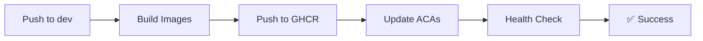

# 🚀 Deployment README - Therapy Engage Platform

## Quick Start

### 1. Azure Infrastructure Setup (via Terraform)

The Azure Container Apps infrastructure should already be deployed via Terraform, including:
- Resource Group
- Container Apps Environment
- Frontend Container App
- Backend Container App
- Networking and security configurations

### 2. Configure GitHub Secrets

Go to your GitHub repository → Settings → Secrets and variables → Actions

Add these required secrets:

| Secret | Value | How to Get |
|--------|--------|------------|
| `AZURE_CLIENT_ID` | Service Principal Client ID | Azure App Registration |
| `AZURE_TENANT_ID` | Azure AD Tenant ID | Azure Portal → Azure Active Directory |
| `AZURE_SUBSCRIPTION_ID` | Your subscription ID | Azure Portal → Subscriptions |
| `RESOURCE_GROUP` | Resource group name | From Terraform outputs |
| `ACA_FRONTEND_NAME` | Frontend app name | From Terraform outputs |
| `ACA_BACKEND_NAME` | Backend app name | From Terraform outputs |

### 3. Deploy Your First Version

```bash
# Merge changes to dev branch (triggers automatic deployment)
git checkout dev
git pull origin dev

# Or create a feature branch and merge via PR
git checkout -b feature/initial-deployment
git add .
git commit -m "feat: initial container deployment setup"
git push origin feature/initial-deployment

# Create Pull Request on GitHub
# After approval, merge to dev branch
# Automatic deployment will trigger
```

## CI/CD Pipeline Overview



### Pipeline Stages

1. **Build & Push** (2-3 minutes)
   - Build frontend Docker image
   - Build backend Docker image  
   - Push to GitHub Container Registry
   - Tag with commit SHA

2. **Deploy to ACA** (1-2 minutes)
   - Azure OIDC authentication
   - Update container apps with new images
   - Set environment variables

3. **Health Check** (1 minute)
   - Verify backend `/health` endpoint
   - Verify frontend `/api/health` endpoint

## Environment Structure

### Free Tier Setup
```
Production Environment
├── Azure App Service (Free Tier)
├── Node.js 18 Runtime
├── Automatic SSL (*.azurewebsites.net)
└── Health Monitoring
```

### Standard/Premium Tier Setup
```
Production Environment
├── Azure App Service (Standard/Premium)
├── Production Slot
├── Staging Slot (blue/green deployment)
├── Custom Domain & SSL
└── Advanced Monitoring
```

## Monitoring & Health Checks

### Automatic Health Checks

The system includes built-in health monitoring:

- **Endpoint**: `https://your-app.azurewebsites.net/api/health`
- **Monitoring**: Every 5 minutes during deployment
- **Response**: JSON with status, uptime, memory usage

### Manual Verification

Use the verification script after deployment:

```powershell
.\scripts\verify-deployment.ps1 -AppUrl "https://your-app.azurewebsites.net"
```

## Deployment Strategies

### 1. Standard Deployment (Free Tier)
- Direct deployment to production
- Automatic health checks
- Rollback on failure

### 2. Blue-Green Deployment (Standard+ Tier)
- Deploy to staging slot
- Smoke tests on staging
- Swap slots on success
- Instant rollback capability

## Troubleshooting

### Common Issues

#### Build Failures
```powershell
# Check build logs in GitHub Actions
# Clear local cache and retry
npm run clean
npm ci
npm run build
```

#### Health Check Failures
```powershell
# Check application logs
az webapp log tail --name your-app --resource-group your-rg

# Test health endpoint manually
curl https://your-app.azurewebsites.net/api/health
```

#### Deployment Timeouts
- Verify Azure App Service is running
- Check resource limits (Free tier has limitations)
- Review application startup time

### Debug Commands

```powershell
# Check Azure App Service status
az webapp show --name your-app --resource-group your-rg --query "state"

# View recent deployments
az webapp deployment list --name your-app --resource-group your-rg

# Restart application
az webapp restart --name your-app --resource-group your-rg

# View live logs
az webapp log tail --name your-app --resource-group your-rg
```

## Branch Strategy

### Recommended Git Workflow

```
main (production)
├── develop (integration)
│   ├── feature/sprint-d3-icons
│   ├── feature/auth-improvements
│   └── hotfix/urgent-bug-fix
└── release/v1.0.0
```

### Branch Protection Rules

- `main` branch requires PR reviews
- Status checks must pass before merge
- Automatic deployment on merge to `main`

## Performance Optimization

### Free Tier Limitations
- 60 minutes CPU time per day
- 1 GB RAM
- 1 GB storage
- Cold start delays

### Optimization Strategies
- Minimize bundle size
- Optimize images and assets
- Use efficient database queries
- Implement proper caching

## Security Considerations

### Automated Security Scanning
- NPM audit for known vulnerabilities
- Snyk security analysis
- SARIF reports in GitHub

### Environment Security
- Secrets stored in GitHub Secrets
- Environment variables for configuration
- No sensitive data in code repository

## Scaling Guidelines

### When to Upgrade from Free Tier

Consider upgrading when you experience:
- Regular timeout errors
- Slow response times (>5 seconds)
- High traffic volumes
- Need for custom domains
- Requirement for staging environments

### Upgrade Path
1. Free (F1) → Basic (B1) → Standard (S1) → Premium (P1V2)
2. Each tier offers more resources and features
3. Zero-downtime upgrade possible

## Maintenance

### Regular Tasks
- Monitor application health
- Review security scan results
- Update dependencies monthly
- Check Azure resource usage
- Rotate access tokens quarterly

### Automated Maintenance
- Dependency updates via Dependabot
- Security scanning on every PR
- Health monitoring during deployments
- Automatic log cleanup

## Support

### Getting Help
1. Check GitHub Actions logs first
2. Review Azure App Service diagnostics
3. Use the verification script for debugging
4. Contact development team for complex issues

### Useful Links
- [Azure App Service Documentation](https://docs.microsoft.com/en-us/azure/app-service/)
- [GitHub Actions Documentation](https://docs.github.com/en/actions)
- [Next.js Deployment Guide](https://nextjs.org/docs/deployment)

---

## Quick Reference Card

```powershell
# Setup new environment
.\scripts\setup-azure-env.ps1 -ResourceGroupName "rg-name" -AppServiceName "app-name"

# Verify deployment
.\scripts\verify-deployment.ps1 -AppUrl "https://app-name.azurewebsites.net"

# Check health
curl https://app-name.azurewebsites.net/api/health

# View logs
az webapp log tail --name app-name --resource-group rg-name

# Restart app
az webapp restart --name app-name --resource-group rg-name
```

**Remember**: Always use Pull Requests for production deployments! 🚀

## 🔄 Rollback Procedures

### Method 1: Container Apps Revisions

Azure Container Apps automatically creates revisions for each deployment:

```powershell
# List available revisions
az containerapp revision list --name <app-name> --resource-group <rg> --output table

# Activate a previous revision
az containerapp revision activate --name <app-name> --resource-group <rg> --revision <revision-name>

# Set traffic to previous revision
az containerapp ingress traffic set --name <app-name> --resource-group <rg> --revision-weight <revision-name>=100
```

### Method 2: Re-deploy Previous Version

```powershell
# Find the previous commit SHA
git log --oneline -5

# Trigger deployment with previous commit
# Method 1: Reset and push
git reset --hard <previous-commit-sha>
git push origin dev --force

# Method 2: Create revert commit (safer)
git revert <bad-commit-sha>
git push origin dev
```

### Method 3: Manual Rollback via GitHub Actions

1. Go to GitHub Actions → CI + Deploy DEV workflow
2. Click "Run workflow"  
3. Select the `dev` branch
4. Check out the commit you want to deploy to
5. Run the workflow manually

### Emergency Rollback Checklist

- [ ] Identify the last known good revision
- [ ] Check Container Apps logs for errors
- [ ] Verify health endpoints are responding
- [ ] Notify team of rollback action
- [ ] Document the issue for post-mortem
- [ ] Plan fix for the next deployment
