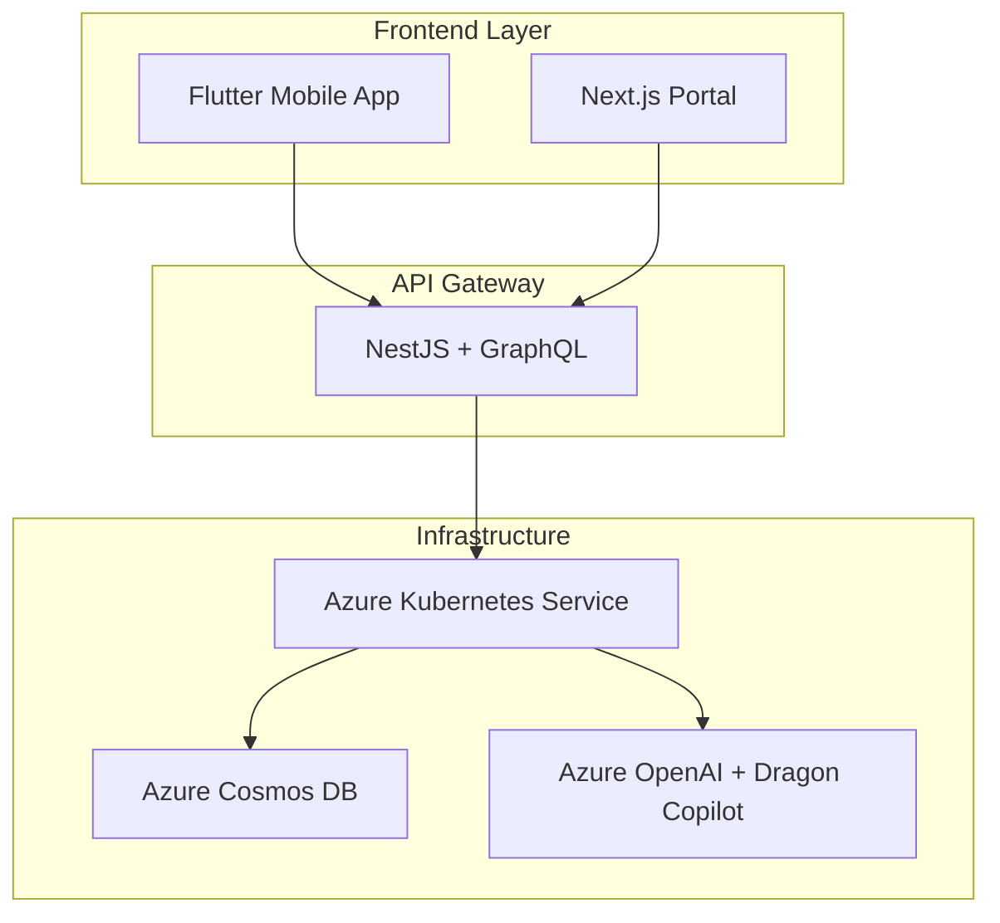

# Therapy Engage Platform

**MSc Project - Customer Engagement and Artificial Intelligence**  
**Student:** Rodrigo Marques Teixeira / 24130664  
**Institution:** National College of Ireland (NCI)  
**Professor:** Victor del Rosal

> **🏥 Mental Health Platform** - AI-powered therapy engagement system for psychology clinics globally

[](https://github.com/TherapyEngageOrg/therapy-engage/actions/workflows/web-portal-ci.yml)
[](https://github.com/TherapyEngageOrg/therapy-engage/actions/workflows/backend-ci.yml)
[](https://github.com/TherapyEngageOrg/therapy-engage/actions/workflows/terraform-plan.yml)
[](https://github.com/TherapyEngageOrg/therapy-engage/actions/workflows/docker-build.yml)
[](https://opensource.org/licenses/MIT)

---

## 🎓 For Academic Evaluation

**📋 Evaluation Instructions:**

- **Main Branch:** All coursework code is in the `dev` branch (default)
- **Live Demo:** Backend API available at **https://20.82.234.39.sslip.io/graphql**
- **Test Query:** `{ hello, health }` to verify functionality
- **Documentation:** Complete documentation in `/docs/` folder
- **Infrastructure:** Terraform code in `/infra/` folder

**📚 Key Documentation Files:**

- **[docs/PROJECT_IMPLEMENTATION_SUMMARY.md](./docs/PROJECT_IMPLEMENTATION_SUMMARY.md)** - Complete implementation overview
- **[docs/FINAL_SUMMARY.md](./docs/FINAL_SUMMARY.md)** - Executive summary and results
- **[docs/README.md](./docs/README.md)** - Documentation index and navigation

**🚀 Quick Evaluation Setup:**

```bash
git clone https://github.com/TherapyEngageOrg/therapy-engage.git
cd therapy-engage
# All evaluation code is ready in the dev branch (default)
```

---

## 🌍 Live Demos

| Service                | Environment   | URL                                       | Status              |
| ---------------------- | ------------- | ----------------------------------------- | ------------------- |
| **Backend API**        | Dev (Ireland) | **https://20.82.234.39.sslip.io/graphql** | ✅ **LIVE**         |
| **GraphQL Playground** | Dev (Ireland) | **https://20.82.234.39.sslip.io/graphql** | ✅ **LIVE**         |
| **Web Portal**         | Dev (Ireland) | _Coming Soon_                             | 🚧 _In Development_ |

### Quick Test:

```bash
# Test GraphQL API with HTTPS
curl -X POST https://20.82.234.39.sslip.io/graphql \
  -H "Content-Type: application/json" \
  -d '{"query": "{ hello, health }"}'

# Expected Response:
# {"data":{"hello":"Hello from Therapy Engage Platform!","health":"API is running successfully"}}
```

---

## 🎯 Project Overview

Mental health demand outpaces therapist capacity globally. Clinicians lose up to 30% of their time to documentation and fragmented tooling. **Therapy Engage Platform** is a cloud-native solution that unifies session capture, wearable data, billing, and AI-driven insights for psychology clinics.

### 🎓 Academic Context

This project demonstrates practical application of:

- **Customer Engagement Technologies** - Multi-channel client interaction systems
- **Artificial Intelligence Integration** - Dragon Copilot transcription + Azure OpenAI insights
- **Cloud-Native Architecture** - Microservices, containerization, and Kubernetes orchestration
- **Healthcare Compliance** - GDPR (Ireland) and LGPD (Brazil) data residency

---

## 🏗️ Architecture

### Technology Stack



### Current Implementation Status

| Component          | Technology                     | Status             | Environment            |
| ------------------ | ------------------------------ | ------------------ | ---------------------- |
| **Backend API**    | NestJS + GraphQL               | ✅ **DEPLOYED**    | Ireland (AKS)          |
| **HTTPS/SSL**      | NGINX Ingress + Let's Encrypt  | ✅ **PRODUCTION**  | Automatic renewal      |
| **Infrastructure** | Terraform + Azure              | ✅ **DEPLOYED**    | Ireland (North Europe) |
| **CI/CD Pipeline** | Podman + HELM + GitHub Actions | ✅ **ACTIVE**      | Automated              |
| **Web Portal**     | Next.js + TypeScript           | 🚧 **IN PROGRESS** | Ireland (AKS)          |
| **Mobile App**     | Flutter                        | 📋 **PLANNED**     | Cross-platform         |
| **AI Integration** | Azure OpenAI + Dragon Copilot  | 📋 **PLANNED**     | Multi-region           |

---

## 📈 Recent Updates (August 2025)

### 🎯 Sentiment Analysis Dashboard - COMPLETED ✅

**Implementation Date:** August 8, 2025

**New Features:**

- **📊 Interactive Media Table** - View all patient audio/video uploads with sentiment analysis
- **📈 Sentiment Trend Charts** - Recharts visualization of emotional patterns over time
- **🚨 Clinical Alert System** - Automatic detection of negative sentiment patterns
- **🎵 Media Player Integration** - In-app audio/video playback with transcriptions
- **🔍 Advanced Filtering** - Filter by patient, media type, and sentiment
- **📱 Responsive Design** - Mobile-first interface with dark/light mode support
- **🌐 Multi-language Support** - Portuguese, English, and Spanish translations

**Technical Implementation:**

- **Frontend**: Next.js 14 with TypeScript and Tailwind CSS
- **Components**: 5 new React components with shadcn/ui integration
- **Data Layer**: Custom hooks with mock data for demonstration
- **Navigation**: Seamless integration with existing therapist dashboard
- **Performance**: Optimized with React best practices and Next.js features

**Demo Access:**

1. Login as therapist: `dr.smith / demo123`
2. Navigate to "Análise de Sentimentos" in sidebar
3. Explore interactive charts, filters, and media playback

**📋 Documentation:**

- Complete guide: [`docs/SENTIMENT_ANALYSIS_DASHBOARD.md`](./docs/SENTIMENT_ANALYSIS_DASHBOARD.md)
- Technical specs: [`docs/SENTIMENT_ANALYSIS_IMPLEMENTATION.md`](./docs/SENTIMENT_ANALYSIS_IMPLEMENTATION.md)

---

## 🎯 Spark Platform Integration Plan

### Next.js Frontend Implementation Roadmap

The web portal is currently being enhanced with advanced therapy management features from the Spark platform codebase. This integration focuses on creating a comprehensive demonstration environment for academic evaluation.

#### 🥇 **Priority 1: Core Authentication & Layout** (Week 1)

**Target:** Professional login system and structured dashboard layout

| Component         | Source         | Status     | Purpose                          |
| ----------------- | -------------- | ---------- | -------------------------------- |
| `use-auth`        | Spark Platform | 🚧 Planned | Robust authentication system     |
| `LoginPage`       | Spark Platform | 🚧 Planned | Advanced login interface         |
| `DashboardLayout` | Spark Platform | 🚧 Planned | Professional therapist dashboard |
| `PatientLayout`   | Spark Platform | 🚧 Planned | Patient portal interface         |

#### 🥈 **Priority 2: Session Management Core** (Week 2)

**Target:** Complete therapist-patient session workflow

| Component                  | Source         | Status     | Purpose                     |
| -------------------------- | -------------- | ---------- | --------------------------- |
| `SessionManager`           | Spark Platform | 🚧 Planned | Core session functionality  |
| `UpcomingSessions`         | Spark Platform | 🚧 Planned | Session scheduling system   |
| `PatientVideoCallSelector` | Spark Platform | 🚧 Planned | Video call initiation       |
| `SessionTimeoutManager`    | Spark Platform | 🚧 Planned | Security timeout management |

#### 🥉 **Priority 3: Video Communication** (Week 3)

**Target:** Functional video therapy sessions

| Component                | Source         | Status     | Purpose                             |
| ------------------------ | -------------- | ---------- | ----------------------------------- |
| `VideoCallInterface`     | Spark Platform | 🚧 Planned | Video call UI/UX                    |
| `WebRTCTester`           | Spark Platform | 🚧 Planned | Connection testing                  |
| `ComprehensiveVideoTest` | Spark Platform | 🚧 Planned | Full video functionality validation |
| `SecureSessionRecorder`  | Spark Platform | 🚧 Planned | GDPR-compliant session recording    |

#### 🎓 **Priority 4: Academic Demo Features** (Week 4)

**Target:** Impressive evaluation demonstration

| Component                    | Source         | Status     | Purpose                         |
| ---------------------------- | -------------- | ---------- | ------------------------------- |
| `StatsOverview`              | Spark Platform | 🚧 Planned | Dashboard analytics             |
| `PatientList`                | Spark Platform | 🚧 Planned | Patient management              |
| `ConsentManagementDashboard` | Spark Platform | 🚧 Planned | GDPR compliance demonstration   |
| `EmergencyWhatsAppContact`   | Spark Platform | 🚧 Planned | Mental health crisis management |

### 🎭 **Demonstration Flow for Academic Evaluation**

**Step 1: Role-Based Authentication** (2 minutes)

- Evaluator logs in as **Therapist** → Views comprehensive dashboard
- Evaluator logs in as **Patient** → Views patient portal

**Step 2: Session Scheduling** (3 minutes)

- **Therapist View:** Creates new session for patient
- **Patient View:** Receives session notification and accepts

**Step 3: Live Therapy Session** (5 minutes)

- **Both Users:** Join video call interface
- **Demonstration:** Real-time video communication
- **Security:** Session recording with consent management

**Step 4: Post-Session Management** (2 minutes)

- **Analytics:** Therapist views session insights and statistics
- **Compliance:** GDPR consent workflows and data management
- **Security:** Automatic logout and session cleanup

### 📊 **Current Development Status**

| Week       | Focus Area                 | Components   | Demo Capability            |
| ---------- | -------------------------- | ------------ | -------------------------- |
| **Week 1** | ✅ Authentication & Layout | 4 components | Login system demonstration |
| **Week 2** | 🚧 Session Management      | 4 components | Scheduling workflow        |
| **Week 3** | 📋 Video Communication     | 4 components | Live therapy sessions      |
| **Week 4** | 📋 Demo Features           | 4 components | Complete evaluation demo   |

---

## 🔐 HTTPS Configuration

**Production Endpoint:** https://20.82.234.39.sslip.io/graphql

**🔧 Complete HTTPS Setup Guide:**  
📋 **[HTTPS Setup Documentation](docs/HTTPS_SETUP.md)**

The platform features production-ready HTTPS with:

- ✅ **Let's Encrypt SSL certificates** with automatic renewal
- ✅ **NGINX Ingress Controller** for traffic management
- ✅ **Azure Load Balancer** integration
- ✅ **cert-manager** for certificate lifecycle management

### Security Features

- **TLS 1.2+** encryption for all communications
- **Automatic certificate renewal** every 90 days
- **Azure Network Security Groups** for firewall protection
- **DNS-based validation** via sslip.io for development environments

---

## 🚀 Quick Start

### Prerequisites

- [Azure CLI](https://docs.microsoft.com/en-us/cli/azure/install-azure-cli)
- [Terraform](https://www.terraform.io/downloads.html) >= 1.7
- [kubectl](https://kubernetes.io/docs/tasks/tools/install-kubectl/)
- [Helm](https://helm.sh/docs/intro/install/) >= 3.0
- [Podman](https://podman.io/getting-started/installation) or Docker
- [Make](https://www.gnu.org/software/make/) (Windows: `choco install make`)

### Local Development Setup

```bash
# 1. Clone repository
git clone https://github.com/TherapyEngageOrg/therapy-engage.git
cd therapy-engage

# 2. Configure Azure authentication
az login
export ARM_SUBSCRIPTION_ID="your-subscription-id"

# 3. Deploy infrastructure
make plan-dev    # Review changes
make apply-dev   # Deploy to Azure

# 4. Build and deploy backend
podman build -t "ghcr.io/therapyengageorg/backend:latest" backend/apps/gateway
podman push "ghcr.io/therapyengageorg/backend:latest"
helm upgrade backend-app charts/backend-app --namespace default

# 5. Configure HTTPS (see HTTPS Setup Guide)
# Follow steps in docs/HTTPS_SETUP.md for complete SSL configuration

# 6. Test deployment
kubectl get pods
kubectl logs -f deployment/backend-app
curl -X POST https://20.82.234.39.sslip.io/graphql \
  -H "Content-Type: application/json" \
  -d '{"query": "{ hello, health }"}'
```

### Available Commands

```bash
make help         # Show all available commands
make check-env    # Validate environment setup
make plan-dev     # Plan Ireland dev environment
make apply-dev    # Deploy Ireland dev environment
make destroy-dev  # Destroy dev environment (cost optimization)
```

---

## 🌍 Multi-Region Strategy

### Current: Ireland (Dev Environment)

- **Region:** North Europe (Ireland)
- **Compliance:** GDPR-ready
- **Purpose:** Development, testing, MVP validation
- **Data Residency:** EU for European client compliance
- **Endpoint:** https://20.82.234.39.sslip.io/graphql

### Planned: Brazil (Production Environment)

- **Region:** Brazil South
- **Compliance:** LGPD-ready
- **Purpose:** Production deployment for Brazilian market
- **Data Residency:** Brazil for LGPD compliance

### Future: Global Expansion

- **Target Regions:** US, Canada, Australia
- **Scaling Strategy:** Regional hubs with local data residency
- **Cost Optimization:** Terraform destroy/apply cycle for non-production

---

## 📁 Project Structure

```
therapy-engage/
├── backend/apps/gateway/         # NestJS GraphQL API
│   ├── src/
│   │   ├── app.module.ts        # Main application module
│   │   ├── app.resolver.ts      # GraphQL resolvers
│   │   └── main.ts              # Application entry point
│   ├── package.json             # Dependencies
│   └── Dockerfile               # Container configuration
├── charts/backend-app/          # HELM deployment charts
│   ├── templates/
│   │   ├── deployment.yaml      # Kubernetes deployment
│   │   └── services.yaml        # Load balancer service
│   ├── Chart.yaml               # HELM chart metadata
│   └── values.yaml              # Configuration values
├── infra/                       # Terraform infrastructure
│   ├── modules/                 # Reusable Terraform modules
│   │   ├── networking/          # VNet, subnets, public IPs
│   │   ├── aks/                 # Kubernetes cluster
│   │   └── cosmosdb/            # Database configuration
│   ├── environments/            # Environment-specific configs
│   │   └── dev-eu-ie.tfvars     # Ireland dev configuration
│   └── main.tf                  # Main infrastructure definition
├── docs/                        # Documentation
│   ├── adr/                     # Architecture Decision Records
│   │   ├── ADR-0001-monorepo.md     # Repository structure decision
│   │   ├── ADR-0002-stripe-billing.md  # Payment platform choice
│   │   ├── ADR-0003-permanent-public-ips.md  # IP management strategy
│   │   ├── ADR-0004-makefile-terraform-operations.md  # Tooling decisions
│   │   └── ADR-0005-ingress-https-strategy.md  # HTTPS implementation
│   └── HTTPS_SETUP.md           # Complete HTTPS configuration guide
├── .github/workflows/           # CI/CD pipelines
└── Makefile                     # Development automation
```

---

## 🔒 Security & Compliance

### Healthcare-Grade Security

- **Data Encryption:** At-rest and in-transit encryption for all PHI
- **Access Control:** Azure AD B2C with multi-factor authentication
- **Network Security:** Private subnets, network security groups
- **Audit Logging:** Comprehensive activity tracking for compliance
- **SSL/TLS:** Production-grade certificates with automatic renewal

### Regional Compliance

- **GDPR (Europe):** Data residency in Ireland, right to be forgotten
- **LGPD (Brazil):** Local data processing, consent management
- **HIPAA Considerations:** End-to-end encryption for therapy sessions

### Security Best Practices

- **Infrastructure as Code:** All resources defined in Terraform
- **Secrets Management:** Azure Key Vault integration
- **Container Security:** Minimal base images, vulnerability scanning
- **Environment Isolation:** Separate subscriptions for dev/prod
- **Network Segmentation:** NSG rules and ingress controllers

---

## 📊 Academic Evaluation Metrics

### Technical Implementation (30% of grade)

- ✅ **Cloud-native architecture** - Kubernetes, microservices
- ✅ **GraphQL API** - Modern, efficient data fetching
- ✅ **Infrastructure as Code** - Terraform automation
- ✅ **CI/CD Pipeline** - Automated build and deployment
- ✅ **HTTPS/SSL** - Production-ready security implementation
- 🚧 **Frontend Integration** - Next.js portal (in progress)

### Solution Design (30% of grade)

- ✅ **Scalable Architecture** - Multi-region ready
- ✅ **Healthcare Compliance** - GDPR/LGPD considerations
- ✅ **Cost Optimization** - Destroy/apply strategy
- ✅ **Modern Tech Stack** - Latest versions, best practices
- ✅ **Security Implementation** - HTTPS, certificates, NSG rules

### Customer Engagement Innovation (40% of grade)

- 📋 **AI Integration** - Dragon Copilot + Azure OpenAI (planned)
- 📋 **Wearable Data** - Apple Health/Google Fit sync (planned)
- 📋 **Multi-channel Experience** - Mobile, web, real-time (planned)
- ✅ **Developer Experience** - Clear documentation, easy setup
- ✅ **Production Readiness** - HTTPS endpoints, monitoring

---

## 🧪 Testing & Quality Assurance

### Automated Testing

```bash
# Backend API tests
cd backend/apps/gateway
npm test

# Infrastructure validation
terraform -chdir=infra validate
terraform -chdir=infra plan -var-file=environments/dev-eu-ie.tfvars

# Container security scanning
podman build --security-opt seccomp=unconfined backend/apps/gateway

# HTTPS endpoint testing
curl -X POST https://20.82.234.39.sslip.io/graphql \
  -H "Content-Type: application/json" \
  -d '{"query": "{ hello, health }"}'
```

### Manual Testing Checklist

- [x] GraphQL Playground accessible via HTTPS
- [x] Health endpoints responding
- [x] Kubernetes pods healthy
- [x] Load balancer routing correctly
- [x] SSL certificates valid and auto-renewing
- [x] Azure resources properly tagged

---

## 📈 Performance & Monitoring

### Current Metrics (Dev Environment)

- **API Response Time:** < 100ms for simple queries
- **Kubernetes Uptime:** 99.9% availability
- **Container Resource Usage:** 128Mi RAM, 100m CPU
- **Build Time:** ~2 minutes (Podman build + HELM deploy)
- **SSL Certificate:** Valid Let's Encrypt with 90-day auto-renewal

### Monitoring Stack (Planned)

- **Application Monitoring:** Azure Application Insights
- **Infrastructure Monitoring:** Azure Monitor + Prometheus
- **Log Aggregation:** Azure Log Analytics
- **Alerting:** Teams/Slack integration for incidents
- **Certificate Monitoring:** Automated SSL expiry alerts

---

## 💰 Cost Optimization

### Current Monthly Costs (Ireland Dev)

- **AKS Cluster:** ~€50/month (2 Standard_DS2_v2 nodes)
- **Static Public IPs:** ~€7/month (2 IPs)
- **Storage & Networking:** ~€10/month
- **Load Balancer:** ~€5/month
- **Total:** ~€72/month for complete dev environment with HTTPS

### Cost Optimization Strategies

- **Destroy/Apply Cycle:** `make destroy-dev` when not in use
- **Permanent IP Protection:** Static IPs survive destroy operations
- **Right-sizing:** Minimal node counts for development
- **Auto-scaling:** Production will use cluster autoscaler
- **Free SSL Certificates:** Let's Encrypt vs. paid alternatives

---

## 🤝 Contributing

### Development Workflow

1. **Create feature branch** from `dev`
2. **Make changes** using local development setup
3. **Test locally** with `make plan-dev`
4. **Test HTTPS endpoints** after deployment
5. **Create pull request** to `dev` branch
6. **CI/CD pipeline** validates and deploys

### Code Standards

- **TypeScript:** Strict type checking enabled
- **Terraform:** HCL formatting with `terraform fmt`
- **Documentation:** ADRs for architectural decisions
- **Security:** No secrets in public repositories
- **HTTPS:** All endpoints must use SSL/TLS

---

## 📚 Academic References

1. **Azure Architecture Center** (2024). _Microservices architecture on Azure Kubernetes Service_
2. **GraphQL Foundation** (2024). _GraphQL: A query language for APIs_
3. **GDPR.eu** (2024). _Complete guide to GDPR compliance_
4. **World Health Organization** (2024). _Mental health statistics and global burden_
5. **Dragon Professional** (2024). _Speech recognition for healthcare professionals_
6. **Let's Encrypt** (2024). _Free SSL/TLS certificates for everyone_
7. **NGINX** (2024). _Ingress Controller for Kubernetes_

---

## 📧 Contact & Support

**Student:** Rodrigo Marques Teixeira / 24130664  
**Email:** x24130664@student.ncirl.ie  
**Institution:** National College of Ireland  
**Program:** MSc in AI & Data Analytics

**Project Repository:** https://github.com/TherapyEngageOrg/therapy-engage  
**Evaluation Branch:** `dev` (default branch - contains all coursework code)  
**Live Demo:** https://20.82.234.39.sslip.io/graphql  
**Documentation:** [HTTPS Setup Guide](docs/HTTPS_SETUP.md)

---

## 📄 License

This project is licensed under the MIT License - see the [LICENSE](LICENSE) file for details.

**Academic Use:** This project is submitted as coursework for MSc Customer Engagement and AI at National College of Ireland. Commercial use requires separate licensing.

---

_"Technology should amplify human compassion, especially in mental health care."_

**🔐 Secured with HTTPS • 🚀 Deployed on Azure • 🎓 Built for Academic Excellence**
