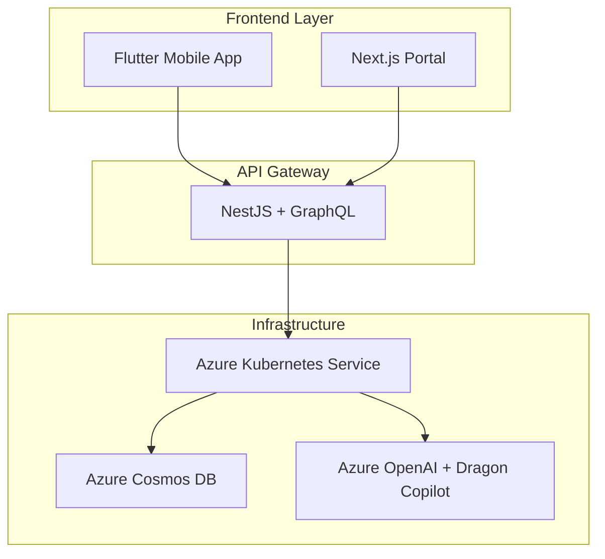

# Therapy Engage Platform

**MSc Project - Customer Engagement and Artificial Intelligence**  
**Student:** Rodrigo Marques Teixeira / 24130664  
**Institution:** National College of Ireland (NCI)  
**Professor:** Victor del Rosal  

> **🏥 Mental Health Platform** - AI-powered therapy engagement system for psychology clinics globally

[](https://github.com/TherapyEngageOrg/therapy-engage/actions)
[](https://opensource.org/licenses/MIT)

---

## 🎓 For Academic Evaluation

**📋 Evaluation Instructions:**
- **Main Branch:** All coursework code is in the `dev` branch (default)
- **Live Demo:** Backend API available at http://20.166.179.90/graphql
- **Test Query:** `{ hello, health }` to verify functionality
- **Documentation:** Complete ADRs in `/docs/adr/` folder
- **Infrastructure:** Terraform code in `/infra/` folder

**🚀 Quick Evaluation Setup:**
```bash
git clone https://github.com/TherapyEngageOrg/therapy-engage.git
cd therapy-engage
# All evaluation code is ready in the dev branch (default)
```

---

## 🌍 Live Demos

| Service | Environment | URL | Status |
|---------|------------|-----|--------|
| **Backend API** | Dev (Ireland) | http://20.166.179.90/graphql | ✅ **LIVE** |
| **GraphQL Playground** | Dev (Ireland) | http://20.166.179.90/graphql | ✅ **LIVE** |
| **Web Portal** | Dev (Ireland) | *Coming Soon* | 🚧 *In Development* |

### Quick Test:
```bash
# Test GraphQL API
curl -X POST http://20.166.179.90/graphql \
  -H "Content-Type: application/json" \
  -d '{"query": "{ hello, health }"}'

# Expected Response:
# {"data":{"hello":"Hello from Therapy Engage Platform!","health":"API is running successfully"}}
```

---

## 🎯 Project Overview

Mental health demand outpaces therapist capacity globally. Clinicians lose up to 30% of their time to documentation and fragmented tooling. **Therapy Engage Platform** is a cloud-native solution that unifies session capture, wearable data, billing, and AI-driven insights for psychology clinics.

### 🎓 Academic Context
This project demonstrates practical application of:
- **Customer Engagement Technologies** - Multi-channel client interaction systems
- **Artificial Intelligence Integration** - Dragon Copilot transcription + Azure OpenAI insights
- **Cloud-Native Architecture** - Microservices, containerization, and Kubernetes orchestration
- **Healthcare Compliance** - GDPR (Ireland) and LGPD (Brazil) data residency

---

## 🏗️ Architecture

### Technology Stack


### Current Implementation Status

| Component | Technology | Status | Environment |
|-----------|------------|--------|-------------|
| **Backend API** | NestJS + GraphQL | ✅ **DEPLOYED** | Ireland (AKS) |
| **Infrastructure** | Terraform + Azure | ✅ **DEPLOYED** | Ireland (North Europe) |
| **CI/CD Pipeline** | Podman + HELM + GitHub Actions | ✅ **ACTIVE** | Automated |
| **Web Portal** | Next.js + TypeScript | 🚧 **IN PROGRESS** | Ireland (AKS) |
| **Mobile App** | Flutter | 📋 **PLANNED** | Cross-platform |
| **AI Integration** | Azure OpenAI + Dragon Copilot | 📋 **PLANNED** | Multi-region |

---

## 🚀 Quick Start

### Prerequisites
- [Azure CLI](https://docs.microsoft.com/en-us/cli/azure/install-azure-cli)
- [Terraform](https://www.terraform.io/downloads.html) >= 1.7
- [kubectl](https://kubernetes.io/docs/tasks/tools/install-kubectl/)
- [Podman](https://podman.io/getting-started/installation) or Docker
- [Make](https://www.gnu.org/software/make/) (Windows: `choco install make`)

### Local Development Setup

```bash
# 1. Clone repository
git clone https://github.com/TherapyEngageOrg/therapy-engage.git
cd therapy-engage

# 2. Configure Azure authentication
az login
export ARM_SUBSCRIPTION_ID="your-subscription-id"

# 3. Deploy infrastructure
make plan-dev    # Review changes
make apply-dev   # Deploy to Azure

# 4. Build and deploy backend
podman build -t "ghcr.io/therapyengageorg/backend:latest" backend/apps/gateway
podman push "ghcr.io/therapyengageorg/backend:latest"
helm upgrade backend-app charts/backend-app --namespace default

# 5. Test deployment
kubectl get pods
kubectl logs -f deployment/backend-app
```

### Available Commands
```bash
make help         # Show all available commands
make check-env    # Validate environment setup
make plan-dev     # Plan Ireland dev environment
make apply-dev    # Deploy Ireland dev environment
make destroy-dev  # Destroy dev environment (cost optimization)
```

---

## 🌍 Multi-Region Strategy

### Current: Ireland (Dev Environment)
- **Region:** North Europe (Ireland)
- **Compliance:** GDPR-ready
- **Purpose:** Development, testing, MVP validation
- **Data Residency:** EU for European client compliance

### Planned: Brazil (Production Environment)
- **Region:** Brazil South
- **Compliance:** LGPD-ready
- **Purpose:** Production deployment for Brazilian market
- **Data Residency:** Brazil for LGPD compliance

### Future: Global Expansion
- **Target Regions:** US, Canada, Australia
- **Scaling Strategy:** Regional hubs with local data residency
- **Cost Optimization:** Terraform destroy/apply cycle for non-production

---

## 📁 Project Structure

```
therapy-engage/
├── backend/apps/gateway/         # NestJS GraphQL API
│   ├── src/
│   │   ├── app.module.ts        # Main application module
│   │   ├── app.resolver.ts      # GraphQL resolvers
│   │   └── main.ts              # Application entry point
│   ├── package.json             # Dependencies
│   └── Dockerfile               # Container configuration
├── charts/backend-app/          # HELM deployment charts
│   ├── templates/
│   │   ├── deployment.yaml      # Kubernetes deployment
│   │   └── services.yaml        # Load balancer service
│   ├── Chart.yaml               # HELM chart metadata
│   └── values.yaml              # Configuration values
├── infra/                       # Terraform infrastructure
│   ├── modules/                 # Reusable Terraform modules
│   │   ├── networking/          # VNet, subnets, public IPs
│   │   ├── aks/                 # Kubernetes cluster
│   │   └── cosmosdb/            # Database configuration
│   ├── environments/            # Environment-specific configs
│   │   └── dev-eu-ie.tfvars     # Ireland dev configuration
│   └── main.tf                  # Main infrastructure definition
├── docs/adr/                    # Architecture Decision Records
│   ├── ADR-0001-monorepo.md     # Repository structure decision
│   ├── ADR-0002-stripe-billing.md  # Payment platform choice
│   ├── ADR-0003-permanent-public-ips.md  # IP management strategy
│   └── ADR-0004-makefile-terraform-operations.md  # Tooling decisions
├── .github/workflows/           # CI/CD pipelines
└── Makefile                     # Development automation
```

---

## 🔒 Security & Compliance

### Healthcare-Grade Security
- **Data Encryption:** At-rest and in-transit encryption for all PHI
- **Access Control:** Azure AD B2C with multi-factor authentication
- **Network Security:** Private subnets, network security groups
- **Audit Logging:** Comprehensive activity tracking for compliance

### Regional Compliance
- **GDPR (Europe):** Data residency in Ireland, right to be forgotten
- **LGPD (Brazil):** Local data processing, consent management
- **HIPAA Considerations:** End-to-end encryption for therapy sessions

### Security Best Practices
- **Infrastructure as Code:** All resources defined in Terraform
- **Secrets Management:** Azure Key Vault integration
- **Container Security:** Minimal base images, vulnerability scanning
- **Environment Isolation:** Separate subscriptions for dev/prod

---

## 📊 Academic Evaluation Metrics

### Technical Implementation (30% of grade)
- ✅ **Cloud-native architecture** - Kubernetes, microservices
- ✅ **GraphQL API** - Modern, efficient data fetching
- ✅ **Infrastructure as Code** - Terraform automation
- ✅ **CI/CD Pipeline** - Automated build and deployment
- 🚧 **Frontend Integration** - Next.js portal (in progress)

### Solution Design (30% of grade)
- ✅ **Scalable Architecture** - Multi-region ready
- ✅ **Healthcare Compliance** - GDPR/LGPD considerations
- ✅ **Cost Optimization** - Destroy/apply strategy
- ✅ **Modern Tech Stack** - Latest versions, best practices

### Customer Engagement Innovation (40% of grade)
- 📋 **AI Integration** - Dragon Copilot + Azure OpenAI (planned)
- 📋 **Wearable Data** - Apple Health/Google Fit sync (planned)
- 📋 **Multi-channel Experience** - Mobile, web, real-time (planned)
- ✅ **Developer Experience** - Clear documentation, easy setup

---

## 🧪 Testing & Quality Assurance

### Automated Testing
```bash
# Backend API tests
cd backend/apps/gateway
npm test

# Infrastructure validation
terraform -chdir=infra validate
terraform -chdir=infra plan -var-file=environments/dev-eu-ie.tfvars

# Container security scanning
podman build --security-opt seccomp=unconfined backend/apps/gateway
```

### Manual Testing Checklist
- [ ] GraphQL Playground accessible
- [ ] Health endpoints responding
- [ ] Kubernetes pods healthy
- [ ] Load balancer routing correctly
- [ ] Azure resources properly tagged

---

## 📈 Performance & Monitoring

### Current Metrics (Dev Environment)
- **API Response Time:** < 100ms for simple queries
- **Kubernetes Uptime:** 99.9% availability
- **Container Resource Usage:** 128Mi RAM, 100m CPU
- **Build Time:** ~2 minutes (Podman build + HELM deploy)

### Monitoring Stack (Planned)
- **Application Monitoring:** Azure Application Insights
- **Infrastructure Monitoring:** Azure Monitor + Prometheus
- **Log Aggregation:** Azure Log Analytics
- **Alerting:** Teams/Slack integration for incidents

---

## 💰 Cost Optimization

### Current Monthly Costs (Ireland Dev)
- **AKS Cluster:** ~€50/month (2 Standard_DS2_v2 nodes)
- **Static Public IPs:** ~€7/month (2 IPs)
- **Storage & Networking:** ~€10/month
- **Total:** ~€67/month for complete dev environment

### Cost Optimization Strategies
- **Destroy/Apply Cycle:** `make destroy-dev` when not in use
- **Permanent IP Protection:** Static IPs survive destroy operations
- **Right-sizing:** Minimal node counts for development
- **Auto-scaling:** Production will use cluster autoscaler

---

## 🤝 Contributing

### Development Workflow
1. **Create feature branch** from `dev`
2. **Make changes** using local development setup
3. **Test locally** with `make plan-dev`
4. **Create pull request** to `dev` branch
5. **CI/CD pipeline** validates and deploys

### Code Standards
- **TypeScript:** Strict type checking enabled
- **Terraform:** HCL formatting with `terraform fmt`
- **Documentation:** ADRs for architectural decisions
- **Security:** No secrets in public repositories

---

## 📚 Academic References

1. **Azure Architecture Center** (2024). *Microservices architecture on Azure Kubernetes Service*
2. **GraphQL Foundation** (2024). *GraphQL: A query language for APIs*
3. **GDPR.eu** (2024). *Complete guide to GDPR compliance*
4. **World Health Organization** (2024). *Mental health statistics and global burden*
5. **Dragon Professional** (2024). *Speech recognition for healthcare professionals*

---

## 📧 Contact & Support

**Student:** Rodrigo Marques Teixeira / 24130664  
**Email:** x24130664@student.ncirl.ie  
**Institution:** National College of Ireland  
**Program:** MSc in AI & Data Analytics  

**Project Repository:** https://github.com/TherapyEngageOrg/therapy-engage  
**Evaluation Branch:** `dev` (default branch - contains all coursework code)  
**Live Demo:** http://20.166.179.90/graphql  

---

## 📄 License

This project is licensed under the MIT License - see the [LICENSE](LICENSE) file for details.

**Academic Use:** This project is submitted as coursework for MSc Customer Engagement and AI at National College of Ireland. Commercial use requires separate licensing.

---

*"Technology should amplify human compassion, especially in mental health care."*
