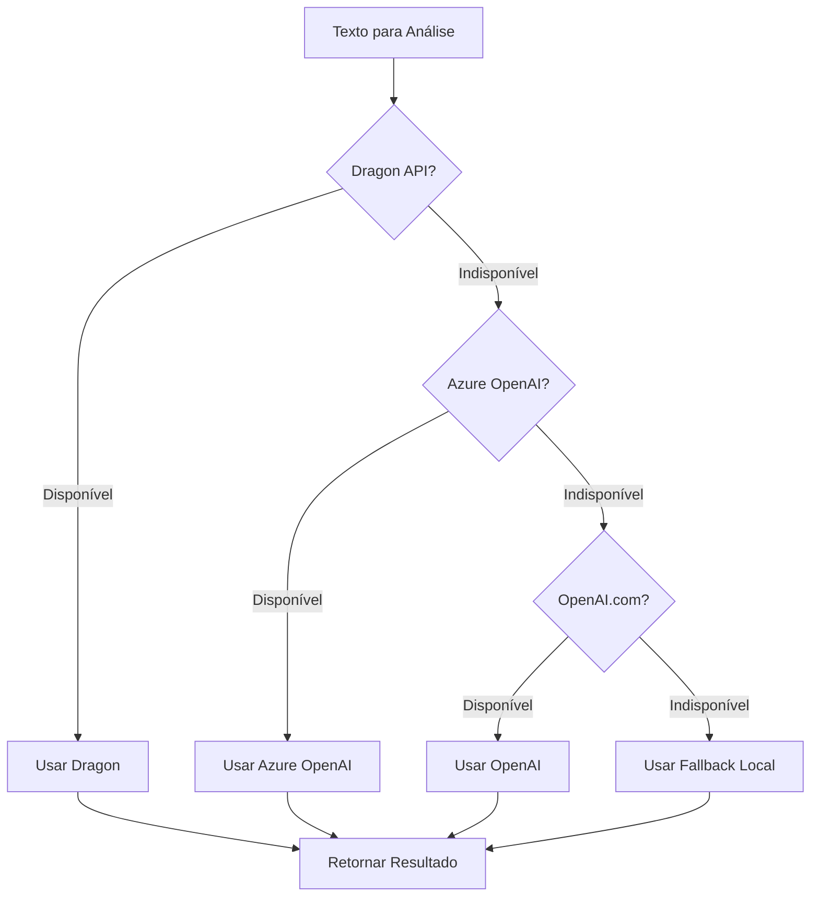

# Azure OpenAI + Backend Fallback Strategy

Esta implementação fornece um sistema robusto de análise de sentimentos com múltiplos provedores de IA e estratégia de fallback inteligente.

## 🎯 Objetivos Alcançados

### ✅ Infraestrutura (Terraform)

- **Azure OpenAI Service** provisionado via Terraform
- Módulo reutilizável em `infra/modules/azure_openai/`
- Configuração de segurança e monitoramento
- Outputs estruturados para configuração de aplicações

### ✅ Backend NestJS

- **SentimentAnalysisService** com fallback inteligente
- Suporte a 3 provedores + fallback local
- APIs REST e GraphQL disponíveis
- Sistema de health checks e monitoramento

## 🧱 Arquitetura

### Estratégia de Fallback

```
1. 🐉 Dragon API (Prioridade 1)
   ↓ (falha)
2. ☁️ Azure OpenAI (Prioridade 2)
   ↓ (falha)
3. 🤖 OpenAI.com (Prioridade 3)
   ↓ (falha)
4. 📝 Análise Local (Fallback)
```

### Fluxo de Decisão



## 🚀 Implementação

### 1. Infraestrutura

#### Terraform Module: `infra/modules/azure_openai/`

```hcl
module "azure_openai" {
  source              = "./modules/azure_openai"
  name                = "therapyengage-openai-dev"
  location            = "North Europe"
  resource_group_name = azurerm_resource_group.rg.name
  tags                = var.tags
}
```

#### Recursos Criados:

- `azurerm_cognitive_account` (Azure OpenAI Service)
- `azurerm_monitor_diagnostic_setting` (Monitoramento)
- Configurações de segurança e rede

### 2. Backend Services

#### SentimentAnalysisService

```typescript
@Injectable()
export class SentimentAnalysisService {
  async analyze(text: string): Promise<SentimentResult> {
    // Estratégia de fallback automática
    if (DRAGON_API_KEY) return this.analyzeWithDragon(text);
    if (AZURE_OPENAI_ENDPOINT) return this.analyzeWithAzureOpenAI(text);
    if (OPENAI_API_KEY) return this.analyzeWithOpenAI(text);
    return this.analyzeWithFallback(text);
  }
}
```

#### APIs Disponíveis:

- **REST**: `POST /sentiment/analyze`
- **GraphQL**: `mutation analyzeSentiment`
- **Health**: `GET /sentiment/health`

## 🔧 Configuração

### Variáveis de Ambiente

```bash
# Prioridade 1: Dragon API
DRAGON_API_KEY=your_dragon_api_key

# Prioridade 2: Azure OpenAI
AZURE_OPENAI_ENDPOINT=https://therapyengage-openai-dev.openai.azure.com/
AZURE_OPENAI_API_KEY=your_azure_openai_key
AZURE_OPENAI_DEPLOYMENT=gpt-4
AZURE_OPENAI_API_VERSION=2024-02-15-preview

# Prioridade 3: OpenAI.com
OPENAI_API_KEY=your_openai_api_key

# Configurações Opcionais
SENTIMENT_TIMEOUT=30000
SENTIMENT_RETRY_ATTEMPTS=2
```

### Deployment Azure OpenAI

#### 1. Provisionar Infraestrutura

```bash
cd infra
terraform plan -var-file="dev-eu-ie.tfvars"
terraform apply
```

#### 2. Deployar Modelos

```bash
# Linux/macOS
./deploy-azure-openai-models.sh

# Windows
.\deploy-azure-openai-models.ps1
```

#### 3. Configurar Backend

```bash
# Obter configurações do Terraform
terraform output backend_environment_variables

# Obter API Key
az cognitiveservices account keys list \
  --name therapyengage-openai-dev \
  --resource-group therapyengage-dev
```

## 📊 Monitoramento

### Health Checks

```bash
# Verificar status dos provedores
GET /sentiment/health
{
  "status": "ok",
  "providers": {
    "dragon": false,
    "azureOpenAI": true,
    "openai": true,
    "fallback": true
  }
}
```

### Métricas de Performance

- **processingTime**: Tempo de processamento em ms
- **provider**: Provedor utilizado na análise
- **confidence**: Nível de confiança do resultado
- **retries**: Número de tentativas realizadas

## 🎯 Resultados

### Formato de Resposta

```typescript
interface SentimentResult {
  label: "POSITIVO" | "NEGATIVO" | "NEUTRO";
  confidence: number; // 0-1
  score: number; // -1 to 1
  summary: string;
  provider: "dragon" | "azure-openai" | "openai" | "fallback";
  metadata: {
    model?: string;
    processingTime: number;
    rawResponse?: any;
  };
}
```

### Exemplo de Uso

```typescript
// REST API
const response = await fetch('/sentiment/analyze', {
  method: 'POST',
  headers: { 'Content-Type': 'application/json' },
  body: JSON.stringify({
    text: "Hoje me sinto muito melhor, consegui dormir bem."
  })
});

// Resultado
{
  "label": "POSITIVO",
  "confidence": 0.87,
  "score": 0.7,
  "summary": "Paciente demonstra melhora significativa no humor",
  "provider": "azure-openai",
  "metadata": {
    "model": "gpt-4",
    "processingTime": 1200
  }
}
```

## 🛡️ Segurança

### Práticas Implementadas

- **API Keys**: Armazenadas como variáveis de ambiente
- **Rate Limiting**: Configurado nos provedores
- **Timeout**: Previne bloqueios longos
- **Retry Logic**: Aumenta confiabilidade
- **Input Validation**: Sanitização de entradas
- **Error Handling**: Logs detalhados sem exposição de dados sensíveis

### Azure OpenAI Security

- **Managed Identity**: Suportado (opcional)
- **Network ACLs**: Configurável via Terraform
- **Diagnostic Settings**: Auditoria completa
- **Key Rotation**: Suportado via Azure

## 📈 Escalabilidade

### Estratégias de Otimização

1. **Cache de Resultados**: Implementar Redis para análises repetidas
2. **Batch Processing**: Processar múltiplos textos simultaneamente
3. **Model Selection**: Usar modelos mais rápidos quando apropriado
4. **Geographic Distribution**: Múltiplas regiões Azure OpenAI

### Limites e Quotas

- **Azure OpenAI**: Configurável via SKU
- **OpenAI.com**: Baseado no plano contratado
- **Fallback**: Sem limites (processamento local)

## 🚨 Troubleshooting

### Problemas Comuns

1. **"No AI providers configured"**

   - Verificar variáveis de ambiente
   - Validar chaves de API

2. **"Azure OpenAI deployment not found"**

   - Executar script de deployment de modelos
   - Verificar nome do deployment

3. **"Timeout errors"**
   - Aumentar SENTIMENT_TIMEOUT
   - Verificar conectividade de rede

### Logs e Debugging

```bash
# Verificar logs do backend
kubectl logs -f deployment/backend-app

# Testar conectividade
curl -X POST http://localhost:3000/sentiment/analyze \
  -H "Content-Type: application/json" \
  -d '{"text":"Teste de conectividade"}'
```

## 🎉 Próximos Passos

### Melhorias Futuras

1. **Cache Redis**: Implementar cache distribuído
2. **Batch API**: Suporte a análise em lote
3. **Webhooks**: Notificações de análises críticas
4. **Analytics**: Dashboard de métricas de uso
5. **A/B Testing**: Comparar eficácia entre provedores

### Integrações

- **Cosmos DB**: Persistir resultados históricos
- **Event Grid**: Processar análises assíncronas
- **Application Insights**: Monitoramento avançado
- **Key Vault**: Gerenciamento seguro de chaves
