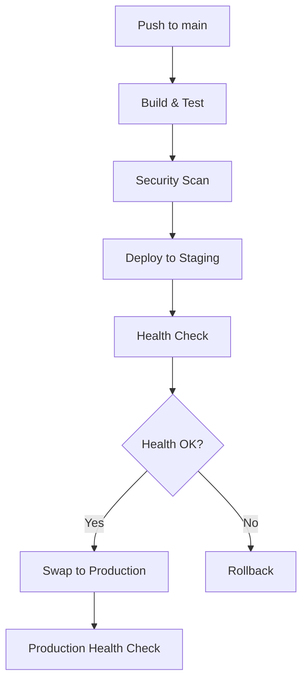

# Deployment Guide - Therapy Engage Platform

## Overview

This guide covers the complete deployment pipeline for the Therapy Engage Platform using GitHub Actions and Azure App Service (Free Tier).

## Prerequisites

### GitHub Repository Setup

1. **Branch Protection Rules** (Required for production)
   - Go to repository Settings → Branches
   - Add rule for `main` branch
   - Enable "Require pull request reviews before merging"
   - Enable "Require status checks to pass before merging"
   - Select required checks: `build-and-test`, `security-scan`

### Azure Setup

1. **Create Azure App Service** (Free Tier)
   ```bash
   # Using Azure CLI
   az webapp create --resource-group your-rg --plan your-plan --name therapy-engage-dev --runtime "NODE|18-lts"
   ```

2. **Configure Deployment Slots**
   ```bash
   # Create staging slot
   az webapp deployment slot create --resource-group your-rg --name therapy-engage-dev --slot staging
   ```

### GitHub Secrets Configuration

Configure the following secrets in your GitHub repository:

| Secret Name | Description | How to Get |
|-------------|-------------|------------|
| `AZURE_WEBAPP_PUBLISH_PROFILE` | Azure deployment credentials | Download from Azure Portal → App Service → Get publish profile |
| `AZURE_WEBAPP_NAME` | Your Azure App Service name | From Azure Portal |
| `SNYK_TOKEN` | Security scanning token | Register at snyk.io and create token |

## Deployment Pipeline

### Workflow Triggers

- **Automatic**: Push to `main` branch
- **Manual**: Workflow dispatch from GitHub Actions tab
- **Pull Requests**: Build and test only (no deployment)

### Pipeline Stages

1. **Build & Test** (`build-and-test`)
   - Node.js 18 setup
   - Install dependencies with `npm ci`
   - Run ESLint checks
   - Execute TypeScript compilation
   - Run test suite
   - Build production bundle
   - Upload build artifacts

2. **Security Scan** (`security-scan`)
   - NPM audit for vulnerabilities
   - Snyk security analysis
   - SARIF report upload to GitHub

3. **Deploy to Azure** (`deploy-to-azure`)
   - Deploy to staging slot
   - Run health checks
   - Swap to production on success

4. **Health Check** (`health-check`)
   - Validate application startup
   - Verify API endpoints
   - Monitor deployment success

### Deployment Flow



## Environment Configuration

### Azure App Service Settings

Add these application settings in Azure Portal:

```bash
# Node.js Configuration
NODE_ENV=production
WEBSITE_NODE_DEFAULT_VERSION=18.17.0

# Next.js Configuration
NEXTJS_BUILD_COMMAND=npm run build
NEXTJS_START_COMMAND=npm start

# Health Check
WEBSITE_HEALTHCHECK_MAXPINGFAILURES=3
```

### Custom Domain & SSL (Optional)

```bash
# Add custom domain
az webapp config hostname add --webapp-name therapy-engage-dev --resource-group your-rg --hostname yourdomain.com

# Enable SSL
az webapp config ssl bind --certificate-thumbprint thumbprint --ssl-type SNI --name therapy-engage-dev --resource-group your-rg
```

## Local Development

### Setup Commands

```bash
# Navigate to web directory
cd web

# Install dependencies
npm ci

# Run development server
npm run dev

# Build for production
npm run build

# Start production server
npm start
```

### Environment Variables

Create `.env.local` in the `web/` directory:

```env
# Development settings
NODE_ENV=development
NEXT_PUBLIC_API_URL=http://localhost:3000

# Add other environment variables as needed
```

## Troubleshooting

### Common Issues

1. **Build Failures**
   ```bash
   # Clear node_modules and package-lock.json
   rm -rf node_modules package-lock.json
   npm install
   ```

2. **Deployment Timeouts**
   - Check Azure App Service logs in Azure Portal
   - Verify health check endpoint responds within 30 seconds

3. **Health Check Failures**
   - Verify `/api/health` endpoint returns 200 status
   - Check application logs for startup errors

### Monitoring

- **Application Logs**: Azure Portal → App Service → Log stream
- **Health Status**: Access `/api/health` endpoint
- **GitHub Actions**: Repository Actions tab for deployment history

## Best Practices

### Code Quality

- Always run `npm run lint` before commits
- Use TypeScript strict mode
- Write meaningful commit messages
- Include tests for new features

### Deployment Safety

- Never push directly to `main` branch
- Always use Pull Requests
- Wait for all status checks to pass
- Test in staging before production

### Security

- Regular dependency updates with `npm audit`
- Scan for vulnerabilities with Snyk
- Never commit sensitive data
- Use environment variables for configuration

## Support

For deployment issues:
1. Check GitHub Actions logs
2. Review Azure App Service diagnostics
3. Verify environment configuration
4. Contact development team if needed

## Quick Reference

### Useful Commands

```bash
# Check deployment status
curl https://your-app.azurewebsites.net/api/health

# View recent deployments
az webapp deployment list --name your-app --resource-group your-rg

# Restart app service
az webapp restart --name your-app --resource-group your-rg

# View logs
az webapp log tail --name your-app --resource-group your-rg
```

### Important URLs

- **Production**: `https://your-app.azurewebsites.net`
- **Staging**: `https://your-app-staging.azurewebsites.net`
- **Health Check**: `https://your-app.azurewebsites.net/api/health`
- **GitHub Actions**: `https://github.com/your-username/therapy-engage/actions`
