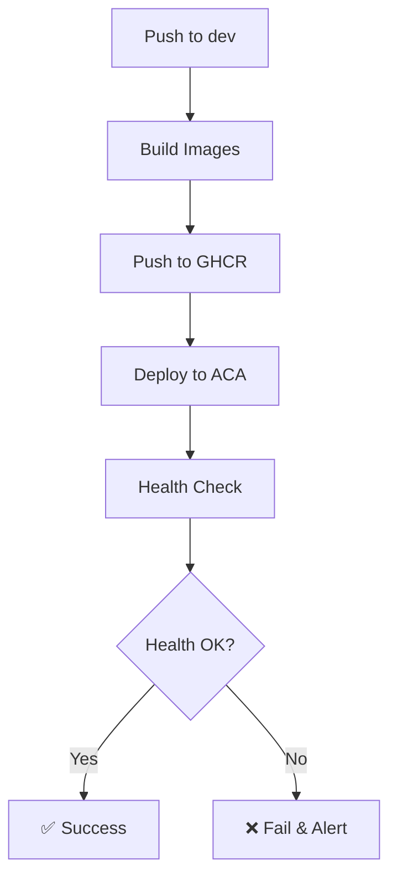

# Deployment Guide - Therapy Engage Platform

## Overview

This guide covers the complete deployment pipeline for the Therapy Engage Platform using GitHub Actions and Azure Container Apps (ACA) with OIDC authentication.

## Prerequisites

### GitHub Repository Setup

1. **Branch Protection Rules** (Required for production)
   - Go to repository Settings → Branches
   - Add rule for `dev` branch
   - Enable "Require pull request reviews before merging"
   - Enable "Require status checks to pass before merging"
   - Select required checks: `build-and-push`, `deploy-aca`

### Azure Setup (via Terraform)

The Azure infrastructure should already be provisioned via Terraform, including:
- Azure Container Apps Environment
- Two Container Apps (frontend and backend)
- Azure Container Registry (or using GitHub Container Registry)
- Resource Group and networking

### GitHub Secrets Configuration

Configure the following secrets in your GitHub repository (Settings → Secrets and variables → Actions):

| Secret Name | Description | How to Get |
|-------------|-------------|------------|
| `AZURE_CLIENT_ID` | OIDC Service Principal Client ID | From Azure App Registration |
| `AZURE_TENANT_ID` | Azure AD Tenant ID | From Azure Portal |
| `AZURE_SUBSCRIPTION_ID` | Azure Subscription ID | From Azure Portal |
| `RESOURCE_GROUP` | Resource Group containing ACAs | From Terraform output |
| `ACA_FRONTEND_NAME` | Frontend Container App name | From Terraform output |
| `ACA_BACKEND_NAME` | Backend Container App name | From Terraform output |

### OIDC Configuration

Set up the Azure Service Principal with OIDC:

```bash
# Create the Azure AD application
az ad app create --display-name "therapy-engage-github-oidc"

# Create service principal
az ad sp create --id <APP_ID>

# Add federated credentials for GitHub
az ad app federated-credential create --id <APP_ID> --parameters '{
  "name": "github-dev-branch",
  "issuer": "https://token.actions.githubusercontent.com",
  "subject": "repo:TherapyEngageOrg/therapy-engage:ref:refs/heads/dev",
  "description": "GitHub Actions Dev Branch",
  "audiences": ["api://AzureADTokenExchange"]
}'
```

## Deployment Pipeline

### Workflow Triggers

- **Automatic**: Push to `dev` branch (not main)
- **Manual**: Workflow dispatch from GitHub Actions tab
- **Pull Requests**: Code review only (no deployment)

### Pipeline Stages

1. **Build & Push** (`build-and-push`)
   - Checkout source code
   - Login to GitHub Container Registry (GHCR)
   - Build frontend Docker image
   - Build backend Docker image
   - Push both images to GHCR with commit SHA tag

2. **Deploy to ACA** (`deploy-aca`)
   - Authenticate with Azure using OIDC
   - Update backend Container App with new image
   - Update frontend Container App with new image
   - Set production environment variables

3. **Health Check** (`health-check`)
   - Wait for containers to start
   - Validate backend health endpoint (`/health`)
   - Validate frontend health endpoint (`/api/health`)
   - Fail deployment if health checks fail

### Deployment Flow



## Environment Configuration

### Azure Container Apps Settings

Environment variables are set automatically during deployment:

```bash
# Production Configuration
NODE_ENV=production

# Additional variables can be added in the workflow
```

### Container Registry

Using GitHub Container Registry (GHCR):
- Registry: `ghcr.io`
- Authentication: GitHub Token (automatic)
- Images tagged with commit SHA for versioning

## Local Development

### Setup Commands

```bash
# Navigate to web directory
cd web

# Install dependencies
npm ci

# Run development server
npm run dev

# Build for production
npm run build

# Start production server
npm start
```

### Environment Variables

Create `.env.local` in the `web/` directory:

```env
# Development settings
NODE_ENV=development
NEXT_PUBLIC_API_URL=http://localhost:3000

# Add other environment variables as needed
```

## Troubleshooting

### Common Issues

1. **Build Failures**
   ```bash
   # Clear node_modules and package-lock.json
   rm -rf node_modules package-lock.json
   npm install
   ```

2. **Deployment Timeouts**
   - Check Azure App Service logs in Azure Portal
   - Verify health check endpoint responds within 30 seconds

3. **Health Check Failures**
   - Verify `/api/health` endpoint returns 200 status
   - Check application logs for startup errors

### Monitoring

- **Application Logs**: Azure Portal → App Service → Log stream
- **Health Status**: Access `/api/health` endpoint
- **GitHub Actions**: Repository Actions tab for deployment history

## Best Practices

### Code Quality

- Always run `npm run lint` before commits
- Use TypeScript strict mode
- Write meaningful commit messages
- Include tests for new features

### Deployment Safety

- Never push directly to `main` branch
- Always use Pull Requests
- Wait for all status checks to pass
- Test in staging before production

### Security

- Regular dependency updates with `npm audit`
- Scan for vulnerabilities with Snyk
- Never commit sensitive data
- Use environment variables for configuration

## Support

For deployment issues:
1. Check GitHub Actions logs
2. Review Azure App Service diagnostics
3. Verify environment configuration
4. Contact development team if needed

## Quick Reference

### Useful Commands

```bash
# Check deployment status
curl https://your-app.azurewebsites.net/api/health

# View recent deployments
az webapp deployment list --name your-app --resource-group your-rg

# Restart app service
az webapp restart --name your-app --resource-group your-rg

# View logs
az webapp log tail --name your-app --resource-group your-rg
```

### Important URLs

- **Production**: `https://your-app.azurewebsites.net`
- **Staging**: `https://your-app-staging.azurewebsites.net`
- **Health Check**: `https://your-app.azurewebsites.net/api/health`
- **GitHub Actions**: `https://github.com/your-username/therapy-engage/actions`
