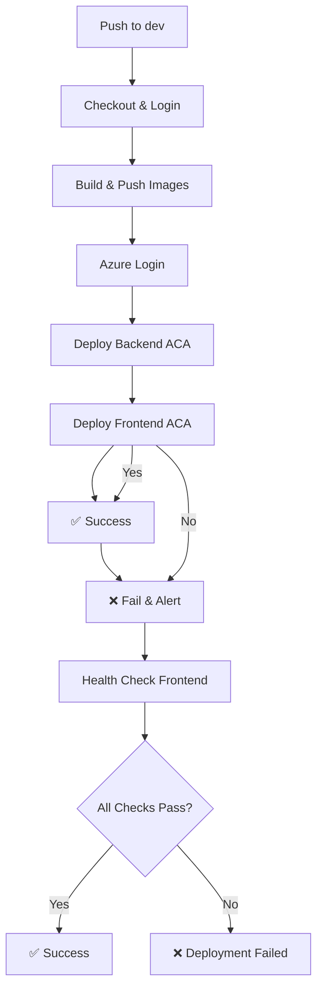

# Deployment Guide - Therapy Engage Platform

## Overview

This guide covers the complete deployment pipeline for the Therapy Engage Platform using GitHub Actions and Azure Container Apps (ACA). The platform supports two authentication methods:

- **DEV Environment**: Service Principal with Secret (simplified setup)
- **PROD Environment**: OIDC authentication (more secure, future implementation)

## Prerequisites

### GitHub Repository Setup

1. **Branch Protection Rules** (Required for production)
   - Go to repository Settings → Branches
   - Add rule for `dev` branch
   - Enable "Require pull request reviews before merging"
   - Enable "Require status checks to pass before merging"
   - Select required checks: `build-deploy`

### Azure Setup (via Terraform)

The Azure infrastructure should already be provisioned via Terraform, including:

- Azure Container Apps Environment
- Two Container Apps (frontend and backend)
- Resource Group and networking
- GitHub Container Registry (GHCR) integration

## DEV Environment Setup (Service Principal)

### GitHub Secrets Configuration

Configure the following secrets in your GitHub repository (Settings → Secrets and variables → Actions):

| Secret Name         | Description                    | How to Get             |
| ------------------- | ------------------------------ | ---------------------- |
| `AZURE_CREDENTIALS` | Service Principal JSON (SDK)   | Run setup script below |
| `RESOURCE_GROUP`    | Resource Group containing ACAs | From Terraform output  |
| `ACA_FRONTEND_NAME` | Frontend Container App name    | From Terraform output  |
| `ACA_BACKEND_NAME`  | Backend Container App name     | From Terraform output  |

### Service Principal Setup

Run the provided setup script to create the Service Principal:

```powershell
# Run from project root
.\scripts\setup-service-principal-dev.ps1

# Or with specific parameters
.\scripts\setup-service-principal-dev.ps1 -ResourceGroupName "rg-therapy-engage-dev" -SubscriptionId "your-subscription-id"
```

This script will:

- Create a Service Principal with Contributor role scoped to your DEV resource group
- Generate the `AZURE_CREDENTIALS` JSON in SDK format
- Output all required secret values for GitHub Actions

### Alternative Manual Setup

```bash
# Create Service Principal with RBAC limited to DEV Resource Group
az ad sp create-for-rbac \
  --name "therapy-engage-dev-sp" \
  --role contributor \
  --scopes /subscriptions/<SUBSCRIPTION_ID>/resourceGroups/<RESOURCE_GROUP> \
  --sdk-auth

# Copy the JSON output to AZURE_CREDENTIALS secret
```

## PROD Environment Setup (OIDC - Future)

### GitHub Secrets Configuration

For production deployment (future implementation):

| Secret Name             | Description                      | How to Get                  |
| ----------------------- | -------------------------------- | --------------------------- |
| `AZURE_CLIENT_ID`       | OIDC Service Principal Client ID | From Azure App Registration |
| `AZURE_TENANT_ID`       | Azure AD Tenant ID               | From Azure Portal           |
| `AZURE_SUBSCRIPTION_ID` | Azure Subscription ID            | From Azure Portal           |

### OIDC Configuration

Set up the Azure Service Principal with OIDC (for future PROD deployments):

```bash
# Create the Azure AD application
az ad app create --display-name "therapy-engage-github-oidc"

# Create service principal
az ad sp create --id <APP_ID>

# Add federated credentials for GitHub
az ad app federated-credential create --id <APP_ID> --parameters '{
  "name": "github-dev-branch",
  "issuer": "https://token.actions.githubusercontent.com",
  "subject": "repo:TherapyEngageOrg/therapy-engage:ref:refs/heads/dev",
  "description": "GitHub Actions Dev Branch",
  "audiences": ["api://AzureADTokenExchange"]
}'
```

## Deployment Pipeline

### Workflow Triggers

- **Automatic**: Push to `dev` branch (not main)
- **Manual**: Workflow dispatch from GitHub Actions tab
- **Pull Requests**: Code review only (no deployment)

### Pipeline Stages

1. **Build & Push** (Single Job: `build-deploy`)

   - Checkout source code
   - Login to GitHub Container Registry (GHCR)
   - Build frontend Docker image with tags: `sha` and `dev-latest`
   - Build backend Docker image with tags: `sha` and `dev-latest`
   - Push both tagged images to GHCR
   - Authenticate with Azure using Service Principal
   - Update backend Container App with new image
   - Update frontend Container App with new image
   - Run health checks on both services

### Image Tagging Strategy

- **Commit SHA**: `ghcr.io/therapyengageorg/therapy-engage/frontend:abc123def`
- **Latest DEV**: `ghcr.io/therapyengageorg/therapy-engage/frontend:dev-latest`

This dual tagging approach allows for:

- Precise deployment tracking with SHA tags
- Easy latest version identification with `dev-latest`
- Rollback capability using specific SHA tags

### Health Check Endpoints

- **Backend**: `GET /health` expects `{"status":"ok"}`
- **Frontend**: `GET /api/health` expects HTTP 200 status

### Pipeline Flow



## Environment Configuration

### Azure Container Apps Settings

Environment variables are set automatically during deployment:

```bash
# Production Configuration
NODE_ENV=production

# Additional variables can be added in the workflow
```

### Container Registry

Using GitHub Container Registry (GHCR):

- Registry: `ghcr.io`
- Authentication: GitHub Token (automatic)
- Images tagged with commit SHA for versioning

## Local Development

### Setup Commands

````bash
# Navigate to web directory
cd web

# Install dependencies
npm ci

# Run development server
npm run dev

# Build for production
npm run build

## Rollback Procedures

### Azure Container Apps Revisions (Recommended)

For quick rollbacks without rebuilding:

```bash
# List available revisions
az containerapp revision list \
  --name <ACA_BACKEND_NAME> \
  --resource-group <RESOURCE_GROUP> \
  --output table

# Rollback to previous revision
az containerapp revision set-mode \
  --name <ACA_BACKEND_NAME> \
  --resource-group <RESOURCE_GROUP> \
  --mode single

az containerapp revision set-active \
  --name <ACA_BACKEND_NAME> \
  --resource-group <RESOURCE_GROUP> \
  --revision <PREVIOUS_REVISION_NAME>
````

### Git Revert + Redeploy

For source code rollbacks:

```bash
# Revert last commit and redeploy
git revert HEAD --mainline 1
git push origin dev
```

See [ROLLBACK_GUIDE.md](./ROLLBACK_GUIDE.md) for detailed rollback procedures.

## Terraform Integration

### Get Infrastructure Values

```bash
cd infra
terraform output -raw resource_group_name
terraform output -raw aca_frontend_name
terraform output -raw aca_backend_name
```

### Update Outputs

If you need additional outputs for the CI/CD pipeline, add them to `infra/outputs.tf`:

```hcl
output "additional_value" {
  description = "Description of the output"
  value       = azurerm_resource.example.property
  sensitive   = false
}
```

## Troubleshooting

### Common Issues

1. **Authentication Failures**

   ```bash
   # Verify Service Principal credentials
   az login --service-principal \
     --username <CLIENT_ID> \
     --password <CLIENT_SECRET> \
     --tenant <TENANT_ID>
   ```

2. **Container App Update Failures**

   - Check Container App logs in Azure Portal
   - Verify image exists in GHCR
   - Ensure resource group and ACA names are correct

3. **Health Check Failures**
   - Verify health endpoints respond within timeout
   - Check application startup logs
   - Validate container environment variables

### Monitoring

- **Container Logs**: Azure Portal → Container Apps → Log stream
- **Health Status**: Direct endpoint access via Container App FQDN
- **GitHub Actions**: Repository Actions tab for deployment history
- **Revision Status**: Azure Portal → Container Apps → Revisions

## Best Practices

### Code Quality

- Always run `npm run lint` before commits
- Use TypeScript strict mode
- Write meaningful commit messages
- Include tests for new features

### Deployment Safety

- Never push directly to `main` branch
- Always use Pull Requests
- Wait for all status checks to pass
- Test in staging before production

### Security

- Regular dependency updates with `npm audit`
- Scan for vulnerabilities with Snyk
- Never commit sensitive data
- Use environment variables for configuration

## Support

For deployment issues:

1. Check GitHub Actions logs
2. Review Azure App Service diagnostics
3. Verify environment configuration
4. Contact development team if needed

## Quick Reference

### Useful Commands

```bash
# Check deployment status
curl https://your-app.azurewebsites.net/api/health

# View recent deployments
az webapp deployment list --name your-app --resource-group your-rg

# Restart app service
az webapp restart --name your-app --resource-group your-rg

# View logs
az webapp log tail --name your-app --resource-group your-rg
```

### Important URLs

- **Production**: `https://your-app.azurewebsites.net`
- **Staging**: `https://your-app-staging.azurewebsites.net`
- **Health Check**: `https://your-app.azurewebsites.net/api/health`
- **GitHub Actions**: `https://github.com/your-username/therapy-engage/actions`
